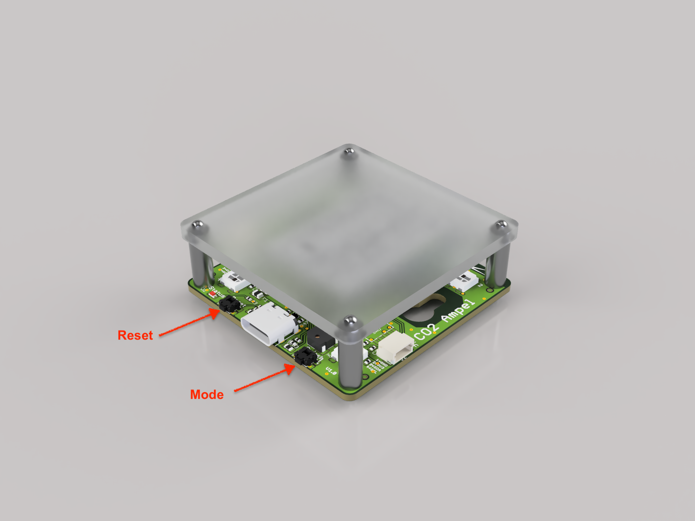
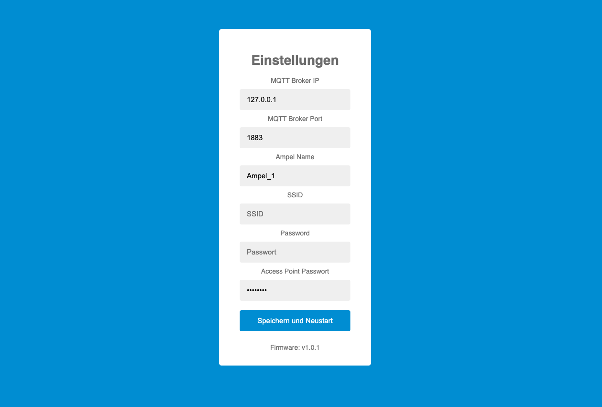
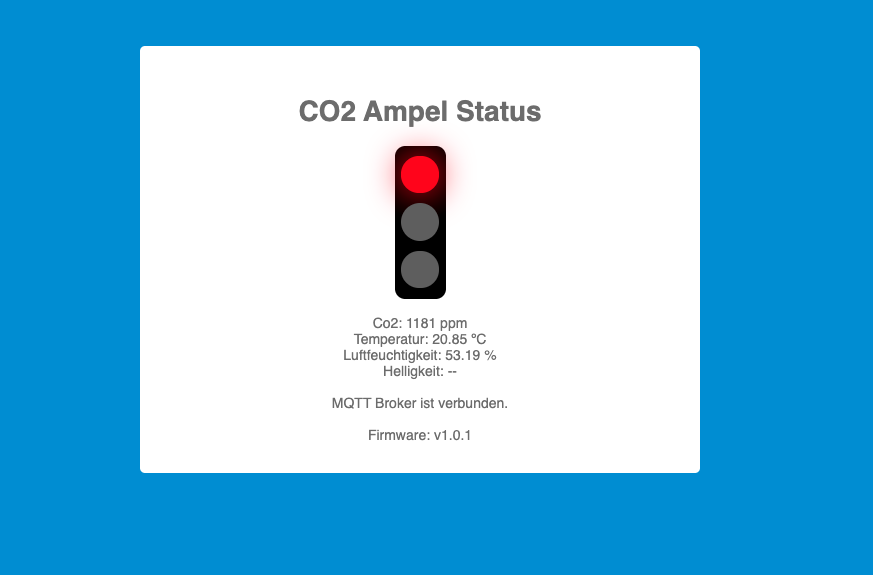
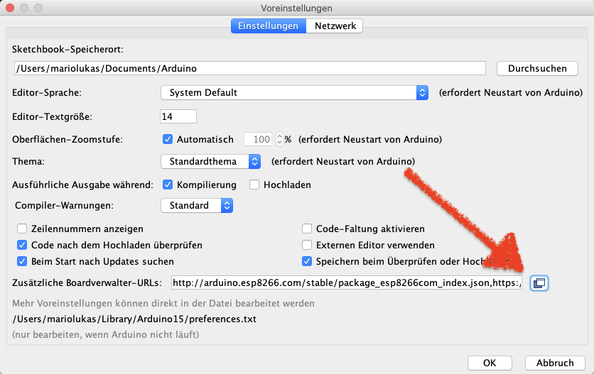
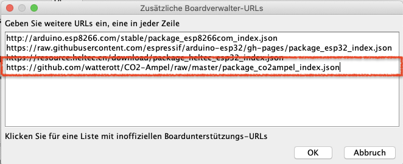

# Watterott Co2 Ampel Plus

Dieses Repository beinhaltet die Firmware für die Watterott Co2 Ampel Plus, welche die Messwerte der Co2 Ampel über WiFi mit Hilfe von MQTT an ein zentrales Monitoring versenden kann. Außerdem verfügt die Firmware über ein kleines Webinterface welches die gemessenen Daten in Form von Text und einer kleinen Ampel Grafik anzeigt.

## Funktion

### Tastenbelegung

Die Ampel verfügt über zwei Tasten. Die von der USB Buchse aus links gelegene Taste ist der Reset Taster, die rechte die Mode Taste. Die weiteren Funktionen sind im folgenden näher beschrieben.



### Startvorgang und Normalmodus
Nachdem Einschalten leuchtet die Ampel zunächst weiß. Zu diesem Zeitpunkt wird unter anderem der CO2 Sensor Initialisiert. 
Sobald die LED's von weiß auf Grün, Gelb, Rot oder Rot blinken wechseln befindet sich die Ampel im Normalbetrieb und zeigt den aktuellen CO2 Status an.

Diverse LED Muster zeigen Fehlermeldungen an. Hierzu näheres im Abschnitt LED Fehlercodes.

### WiFi Einrichten

Um die Ampel an das WLAN anzubinden muss die Ampel zunächst dafür konfiguriert werden. Dies erreicht man indem man die Ampel in den AP (Access Point) Modus versetzt. Dazu startet man die Ampel. Sobald die Ampel im Normalbetrieb ist, drückt man den Mode Taster für mind. 3 Sekunden. Die Ampel wechselt in den AP Modus. Dies wird durch ein dauerhaftes blaues leuchten quittiert.

Anschließend öffnet die Ampel einen Access Point. Unter den vom Rechner gefunden WLAN Netzen erscheint ein Netz mit dem Namen "CO2 Ampel xx:yy". Wobei xx:yy für jede Ampel unterschiedlich sein kann.

Mit diesem Netz verbindet man den Rechner. Bei der Passwort Abfrage gibt man als Passwort ```co2admin```ein (sofern das Passwort nicht bereits geändert wurde).

Wenn der Rechner mit dem Netz der Ampel verbunden ist kann man mit dem Browser über die Adresse ```http://192.169.1.1``` die Einstellungen der Ampel erreichen.



Hier genügt es die SSID und das Passwort für das eigene WLAN einzutragen und anschließend zu speichern. Die Ampel startet dann neu und wird mit dem Heimnetz verbunden. Die IP Adresse der Ampel kann man zum Beispiel über den Router herausfinden oder über einen IP Scanner wie z.B. [https://www.advanced-ip-scanner.com/de/](https://www.advanced-ip-scanner.com/de/) (Mac Benutzer können [LanScan](https://apps.apple.com/de/app/lanscan/id472226235?mt=12) verwenden.)

Die so gefundene IP kann verwendet werden um den Status der Ampel auch über einen Webbrowser einsehen zu können. Hierzu gibt man in der Adressleiste des Browsers die Adresse ```http://<ip_der_ampel>``` ein. Anschließend erscheint das Webinterface der Ampel.



Die Einstellungen können jederzeit wieder verändert werden, indem man die Ampel wieder in den AP Modus versetzt.

### MQTT Einrichten
Möchte man ein erweitertes Monitoring so kann man dies erreichen indem man das [CO2 Monitoring Projekt für die Ampel](https://github.com/mariolukas/Docker-CO2-Monitoring) einrichtet.

In der Ampel muss dazu jedoch eine MQTT Broker Verbindung eingerichtet werden. Hierzu trägt man im AP Mode die MQTT Broker IP ein. Die IP Adresse muss die gleich sein unter welcher das oben verlinkte Projekt eingerichtet wurde. Nachdem man die Ampel neu startet, verbindet sich die Ampel zusätzlich über das WLAN Netz mit dem MQTT Broker und beginnt Status Daten an diesen zu übermitteln. 

Diese Daten können dann bequem über das oben stehende Projekt mittels Grafana ausgewertet werden.

### Auf Werkseinstellungen zurücksetzen

Die Ampel kann auf die Standart Werte zurückgesetzt werden indem man den Mode Taster gedrückt hält während man über den Reset Taster einmal kurz betätigt. (Alternativ kann man auch die Spannungsversorgung vom Gerät trennen und bei gedrücktem Mode Taster wieder einstecken). Ein kurzes rotes aufblinken vor dem Normalbetrieb zeigt an das die Ampel erfolgreich zurückgesetzt wurde.


## Neue Ampel Firmware Version installieren
Um eine neue Ampel Firmware zu installieren muss die Ampel in den Massenspeicher Modus versetzt werden. Dies kann man erreichen indem man den Reset Taster (linker Taster) zwei mal kurz hintereinander drückt. Die Ampel meldet sich ähnlich wie ein USB Stick als neues Laufwerk am Rechner an. 

Um die neue Firmware zu installieren kopiert man einfach die entsprechende entsprechende Firmware Datei auf dieses Laufwerk. Die Ampel installiert dann vollautomatisch die neue Firmware und startet neu. 

Achtung: bei der Installation einer neuen Firmware gehen die vorgenommenen Einstellungen ( wie z.B. WiFi SSID und Passwort) verloren und müssen neu gesetzt werden. 

[Die Firmware Releases findet man hier](https://github.com/mariolukas/Watterott-CO2-Ampel-Plus-Firmware/releases).

## Eigene Ampel Version aus den Quellen kompilieren

### Benötigtes Board Support Package
Um die Ampel mit der Arduino IDE kompilieren zu können empfiehlt es sich das passende Board Support Package für die Ampel zu installieren. Hierzu fügt man einfach über Datei -> Einstellungen (bei MacOS: Arduino -> Einstellungen) die folgende Zeile 

```
https://github.com/watterott/CO2-Ampel/raw/master/package_co2ampel_index.json
``` 
hinzu.





Anschließend kann das Co2 Ampel Board über den Arduino Board Manager installiert werden (Werkzeuge -> Board -> Boardverwalter).


Als Board wählt man dann "CO2 Ampel" aus. Wenn die im nächsten Abschnitt aufgelisteten Bibliotheken installiert sind lässt dich der Quellcode kompilieren.

### Benötigte Bibliotheken

Es werden zusätzlich die folgenden Bibliotheken benötigt um das Programm kompilieren zu können.

[https://github.com/adafruit/Adafruit_NeoPixel](https://github.com/adafruit/Adafruit_NeoPixel)

[https://github.com/arduino-libraries/ArduinoMqttClient](https://github.com/arduino-libraries/ArduinoMqttClient)

[https://github.com/JChristensen/JC_Button](https://github.com/JChristensen/JC_Button)

[https://github.com/sparkfun/SparkFun_SCD30_Arduino_Library](https://github.com/sparkfun/SparkFun_SCD30_Arduino_Library)


### Anpassungen
Die meisten Einstellungen wie Schwellwerte für die Ampel sowie Standart-Einstellungen finden sich in der Datei ```Config.h```wieder.


## LED Fehlercodes
### Blaues blinken
Ein Fehler beim Aufbau des Access Points im AP Modus ist aufgetreten. In der Regel hilft ein einfaches neu starten der Ampel. Anschließend kann man erneut versuchen den Access Point Modus zu starten.

Es kann jedoch auch bedeuten dass die Ampel die WLAN Verbindung verloren hat. In diesem Fall laufen die Messungen auf der Ampel weiter, jedoch taucht zwischendurch immer wieder blaues Blinken auf. In diesem Fall sollte die WLAN Verbindung überprüft werden.


### Rotes blinken während des Starts der Ampel
Der CO2 Sensor wurde nicht erkannt oder konnte nicht initialisiert werden. Hier kann ein Neustart durch Reset helfen. Sollte der Fehler nicht verschwinden so kann es sich auch um einen defekt am CO2 Sensor handeln.
